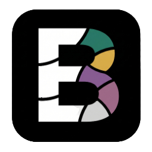
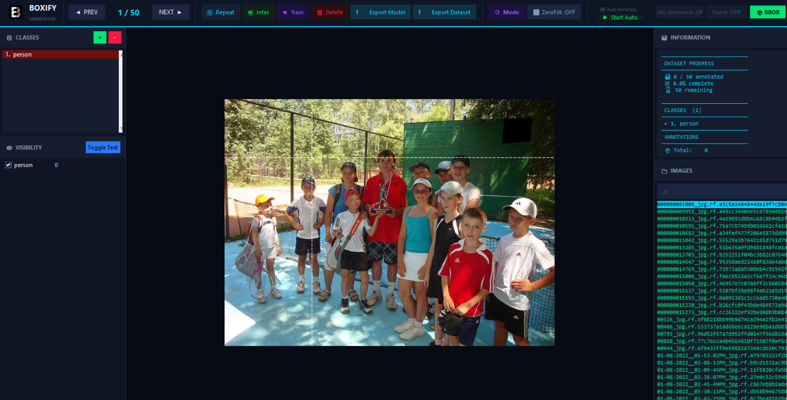
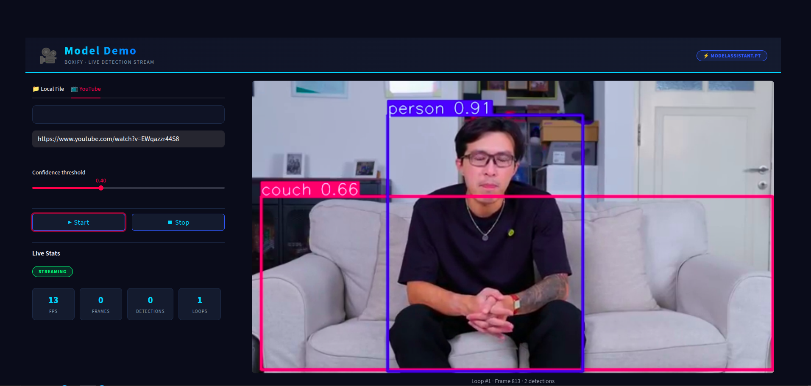

<h1 align="center">Boxify</h1>

<strong>Local Annotation Tool</strong>

  

<h2>🚀 Overview</h2>

<h3>What is Boxify?</h3>

Boxify is a local annotation tool designed to help data annotators label image datasets efficiently.
It is built for users who want a standard annotation workflow that runs offline and supports custom AI models.

<ul>
  <li>Runs fully locally</li>
  <li>Supports custom-trained models</li>
  <li>Speeds up annotation with automation</li>
  <li>Tes your models directly in your computer</li>
</ul>

<h2>✅ Key Features</h2>

<h3>Core Capabilities</h3>
<ul>
  <li>Fully local (no cloud, full privacy)</li>
  <li>Custom model support (Ultralytics)</li>
  <li>Auto annotation (bbox & polygon)</li>
</ul>

<h3>Productivity</h3>
<ul>
  <li>Fast setup (~10 minutes)</li>
  <li>Smart polygon tools (snapping & refinement)</li>
  <li>Repeat annotation support</li>
</ul>

<h3>Compatibility</h3>
<ul>
  <li>YOLO & Pascal VOC export</li>
  <li>Supports Detection & Segmentation</li>
</ul>

<h2>⚙️ Installation</h2>
<h3>Tkinter and Python must match in version.</h3>
<h4>Linux</h4>
<pre>
chmod +x boxify_linux_installation.bash
./boxify_linux_installation.bash
chmod +x Boxify.desktop
</pre>

Launch by double-clicking the Boxify icon.

<h4>Windows</h4>
<pre>
1. Install Microsoft Visual C++ Redistributable from the "VC_redist" folder
   (choose the installer that matches your system architecture: x64, x86, or ARM64).

2. In File Explorer, right-click "boxify_windows_installation.bat"
   and select "Run as administrator".
</pre>

After installation, double-click the Boxify icon.

<h2>🖥️ Interface</h2>

  

  

<h2>⌨️ Controls</h2>

<h3>Navigation</h3>
<table>
<tr><th>Key</th><th>Action</th></tr>
<tr><td>A / ←</td><td>Previous image</td></tr>
<tr><td>D / →</td><td>Next image</td></tr>
<tr><td>Delete</td><td>Remove image</td></tr>
</table>

<h3>Annotation Mode</h3>
<table>
<tr><th>Key</th><th>Action</th></tr>
<tr><td>M</td><td>Toggle mode</td></tr>
<tr><td>B</td><td>Force bbox mode</td></tr>
<tr><td>F</td><td>Auto annotation</td></tr>
<tr><td>P</td><td>Inference on navigation</td></tr>
</table>

<h3>Drawing & Editing</h3>
<table>
<tr><th>Key</th><th>Action</th></tr>
<tr><td>Click</td><td>Add point / select bbox</td></tr>
<tr><td>Double Click / Enter</td><td>Finish polygon</td></tr>
<tr><td>Right Click</td><td>Undo last point</td></tr>
<tr><td>Esc</td><td>Cancel / exit</td></tr>
</table>

<h3>Manage Annotations</h3>
<table>
<tr><th>Key</th><th>Action</th></tr>
<tr><td>S</td><td>Change class</td></tr>
<tr><td>R</td><td>Delete annotation</td></tr>
<tr><td>E</td><td>Repeat annotation</td></tr>
</table>

<h3>AI & Training</h3>
<table>
<tr><th>Key</th><th>Action</th></tr>
<tr><td>G</td><td>Run inference</td></tr>
<tr><td>T</td><td>Start training (GPU)</td></tr>
</table>

<h2>📁 Project Structure</h2>

<h3>Basic Concept</h3>

You can use your own data as long as the folder structure is correct.

Boxify loads image annotations from XML format. If you want to continue an existing project using Boxify, make sure your images are placed in <code>datasetsInput/{workspace}</code>, the corresponding XML annotations are stored in <code>output/{workspace}</code>, and your model is stored in <code>model/{workspace}</code>.

<pre>
datasetsInput/{workspace}-{index}
output/{workspace}
inference/{workspace}
model/{workspace} => # Only accept .pt model (YOLO Model), renamed as modelAssistant.pt
config/{workspace}.txt
</pre>

<h3>Example (workspace: person)</h3>
<pre>
datasetsInput/person or person-1 (for indexing workspace example)
output/person
inference/person
model/person
config/person.txt
</pre>

<h3>Notes</h3>
<ul>
  <li>Each workspace is isolated</li>
  <li>Supports dataset indexing (-1, -2, etc.)</li>
  <li>XML → output/</li>
  <li>YOLO → inference/</li>
  <li>Models stored per workspace</li>
</ul>

<h2>💾 Annotation Format</h2>

<h3>XML</h3>
<pre>
output/{workspace}/*.xml
</pre>

<pre>
&lt;object&gt;
  &lt;name&gt;vehicle&lt;/name&gt;
  &lt;type&gt;polygon&lt;/type&gt;
  &lt;polygon&gt;
    &lt;point&gt;&lt;x&gt;50&lt;/x&gt;&lt;y&gt;100&lt;/y&gt;&lt;/point&gt;
  &lt;/polygon&gt;
&lt;/object&gt;
</pre>

<h3>YOLO</h3>
<pre>
inference/{workspace}
</pre>

<h2>📤 Export</h2>

Export dataset for YOLOX:

<pre>
python exportTools/export2YOLOX.py
</pre>

<h2>🤝 Contributing</h2>

<h3>How to Contribute</h3>

I am very open to anyone who wants to help make Boxify better! To keep the codebase organized and stable, I follow a standard branch-based workflow. Please follow these steps to contribute:

<ol>
  <li><strong>Fork the Repository:</strong> Click the <code>Fork</code> button at the top right of this page to create a copy of the project in your own GitHub account.</li>
  <li><strong>Clone the Project:</strong> Download the code from your forked repository to your local machine.
    <pre>git clone https://github.com/BoxifyAnnotationTools/Boxify.git</pre>
  </li>
  <li><strong>Create a New Branch:</strong> Avoid making changes directly to the <code>main</code> branch. Create a sub-branch for your feature or bug fix.
    <pre>git checkout -b feature/your-feature-name</pre>
    <em>Example: <code>git checkout -b feature/dark-mode-support</code> or <code>fix/zoom-issue</code></em>
  </li>
  <li><strong>Commit Your Changes:</strong> Save your progress with a clear and descriptive commit message.
    <pre>git commit -m "Add: support for Dark Mode interface"</pre>
  </li>
  <li><strong>Push to GitHub:</strong> Upload your new branch to your forked repository.
    <pre>git push origin feature/your-feature-name</pre>
  </li>
  <li><strong>Create a Pull Request:</strong> Go to the original Boxify repository. You will see a notification to create a <code>Pull Request</code>. Explain your changes and submit it for review.</li>
</ol>

<h3>Areas for Contribution</h3>
<ul>
  <li><strong>Code Refactoring & Optimization:</strong> Improving logic efficiency, performance, and overall code quality.</li>
  <li><strong>Feature Development:</strong> Implementing new tools, automation capabilities, or user-requested features.</li>
  <li><strong>Bug Fixes & Documentation:</strong> Resolving issues and improving the clarity of installation or usage guides.</li>
</ul>

<strong>Note:</strong> Please ensure your code is tested locally before submitting a Pull Request to maintain the stability of the core application.

<h2>⚠️ Known Issues</h2>

<h3>RuntimeError: ran out of input</h3>

<h4>Causes</h4>
<ul>
  <li>Low VRAM</li>
  <li>Unsupported GPU features</li>
  <li>Memory fragmentation</li>
</ul>

<h4>Solutions</h4>
<ul>
  <li>Reduce image size</li>
  <li>Lower batch size</li>
  <li>Disable AMP</li>
  <li>Use smaller models</li>
  <li>Check dataset integrity</li>
</ul>

<strong>Note:</strong> Usually caused by hardware limitations.

