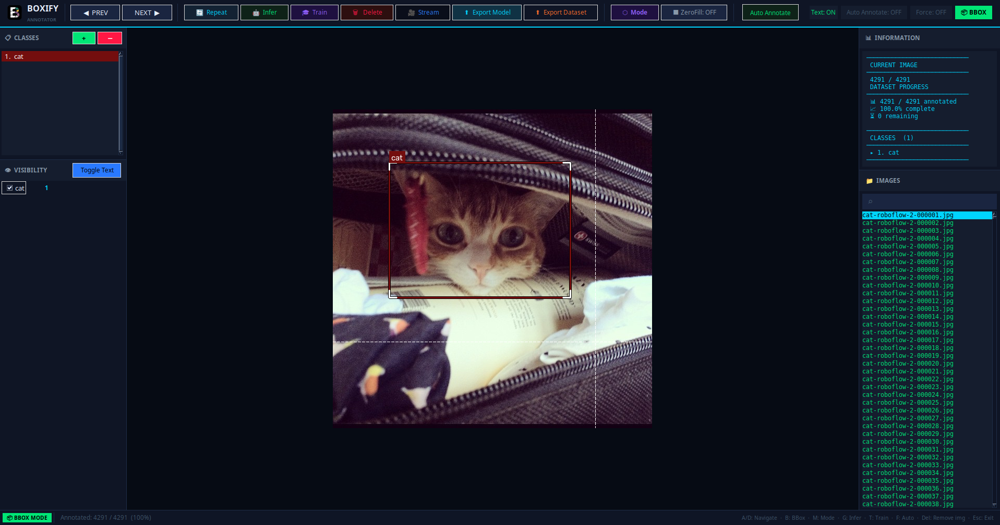
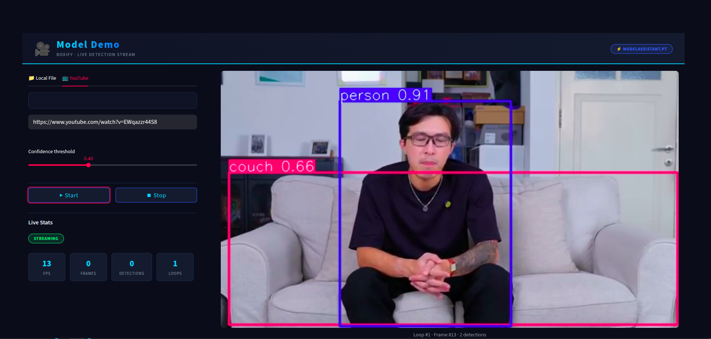

# Boxify

**Boxify is a local computer vision annotation tool for creating object detection and image segmentation datasets.** It runs on your own computer, supports bounding boxes and polygons, and can use Ultralytics YOLO models for inference and training.

[](LICENSE)
[](boxify_linux_installation.bash)
[](boxify_windows_installation.bat)

Boxify is designed for individuals and teams that need a private, offline-first workflow for labeling image datasets without uploading images to a third-party service.



## Features

- Local annotation workflow with no required cloud account
- Bounding box annotation for object detection
- Polygon annotation for image segmentation
- Automatic annotation with an Ultralytics YOLO model
- Model training from the annotation workspace
- NVIDIA CUDA and CPU workflows, depending on the installed PyTorch build
- Class management, visibility toggles, image search, zoom, and multi-selection
- Repeat annotations from the previous image
- ZeroFill masking for removing sensitive image regions locally
- Dataset export for YOLO and Pascal VOC XML
- Live camera or video inference through Streamlit

## Requirements

### Linux

- Debian/Ubuntu/Mint, Fedora/RHEL/CentOS, or Arch/Manjaro
- Python **3.11.9** for the pinned installer
- Tkinter and Python virtual-environment support
- Internet access during installation
- An NVIDIA driver and `nvidia-smi` for the CUDA PyTorch path

### Windows

- 64-bit Windows is recommended
- Python 3.12 is installed by the Windows installer when needed
- Microsoft Visual C++ Redistributable from [`VC_redist/`](VC_redist/)
- Internet access during installation

The application can run on CPU. NVIDIA GPU support requires a compatible NVIDIA driver and a PyTorch build with CUDA support.

## Installation

### Linux

Run these commands from the cloned repository:

```bash
chmod +x boxify_linux_installation.bash
./boxify_linux_installation.bash
```

The installer asks for your `sudo` password at the beginning, installs Python 3.11.9 with Tkinter and venv support, creates the `boxify/` virtual environment, installs dependencies, and creates a desktop launcher.

If your distribution cannot provide Python **3.11.9** exactly, the installer stops instead of silently creating an environment with a different Python version.

### Windows

1. Open [`VC_redist/`](VC_redist/) and install the package matching your system architecture.
2. Right-click [`boxify_windows_installation.bat`](boxify_windows_installation.bat) and choose **Run as administrator**.
3. Follow the installer prompts.
4. Open the generated `Boxify.lnk` shortcut.

The Windows installer checks for an NVIDIA GPU through `nvidia-smi` and uses Windows device information as a fallback. GPU detection does not guarantee that the installed PyTorch package has CUDA enabled.

## Running Boxify Manually

### Linux

```bash
source boxify/bin/activate
python -u utils/Annotator.py
```

### Windows

```bat
venv\Scripts\activate
python utils\Annotator.py
```

## Keyboard Shortcuts

| Key | Action |
| --- | --- |
| `A` / `Left Arrow` | Previous image |
| `D` / `Right Arrow` | Next image |
| `Delete` | Delete the current image |
| `M` | Toggle bounding box and polygon mode |
| `B` | Force a new bounding box |
| `F` | Start or stop auto annotation |
| `P` | Toggle inference while navigating |
| `G` | Run inference on the current image |
| `T` | Open the training workflow |
| `S` | Change the selected annotation class |
| `R` | Delete the selected annotation |
| `E` | Repeat annotations from the previous image |
| `Esc` | Cancel the current operation or exit |

In polygon mode, click to add points, double-click or press `Enter` to finish, and right-click a point to delete it.

## Workspace Structure

Boxify keeps data, annotations, models, and inference files separated by workspace:

```text
datasetsInput/<workspace>-<index>/   Input images for annotation
vocdataset/<workspace>/              Pascal VOC XML annotations
inference/<workspace>/               YOLO images, labels, and data.yaml
models/<workspace>/                  Trained YOLO models
configs/<workspace>.txt              Workspace class configuration
export dataset/<workspace>/          Exported datasets
export model/<workspace>/            Exported model files
```

Example workspace:

```text
datasetsInput/cat-2/
vocdataset/cat/
inference/cat/
models/cat/
configs/cat.txt
```

## Annotation Formats

Boxify supports:

- Bounding boxes for YOLO object detection datasets
- Polygons for segmentation workflows
- Pascal VOC XML annotations in the `vocdataset/` workspace folder
- YOLO labels and dataset configuration in the `inference/` workspace folder
- COCO JSON YOLO exports with bounding boxes and polygon segmentations

## Exporting a Dataset

Use the **Export Dataset** action in the application to export YOLO, Pascal VOC, or COCO data with train, validation, and test splits.

COCO exports use this structure:

```text
<workspace>/
├── images/
│   ├── train/
│   ├── val/
│   └── test/
└── annotations/
	├── instances_train.json
	├── instances_val.json
	└── instances_test.json
```

The COCO exporter reads images from all indexed folders matching `datasetsInput/<workspace>-<index>/` and annotations from `vocdataset/<workspace>/`.

The standalone YOLOX conversion utility can be run with:

```bash
python exportTools/export2YOLOX.py
```

## GPU and PyTorch Troubleshooting

Check the NVIDIA driver first:

```bash
nvidia-smi
```

Then check whether the active Python environment can use CUDA:

```bash
python -c "import torch; print(torch.__version__); print(torch.cuda.is_available()); print(torch.version.cuda)"
```

`nvidia-smi` detecting a GPU does not mean that PyTorch has CUDA enabled. The driver, PyTorch build, CUDA runtime, and GPU architecture must be compatible.

For training failures caused by limited memory, try a smaller image size, a smaller batch size, a smaller model, or a smaller dataset split.

## Screenshots




## Contributing

Issues, documentation improvements, bug fixes, and feature contributions are welcome.

```bash
git clone https://github.com/BoxifyAnnotationTools/Boxify.git
cd Boxify
git checkout -b feature/your-feature-name
```

Before opening a pull request, test the installer or application flow affected by your change and describe the platform used.

## License

Boxify is released under the [MIT License](LICENSE).